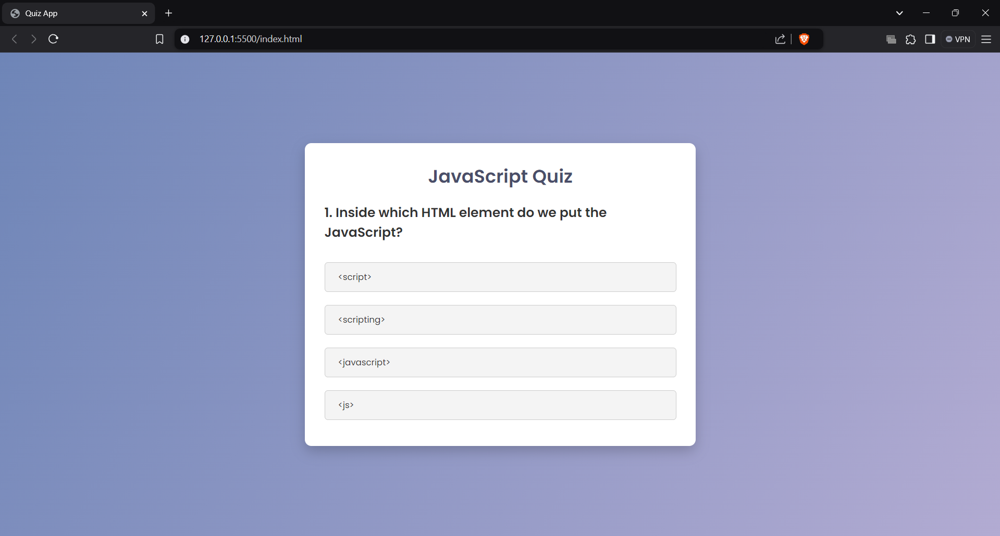
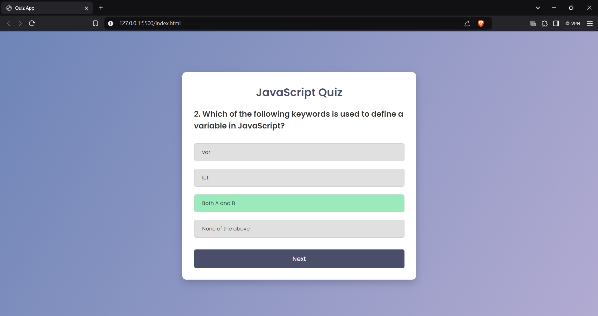
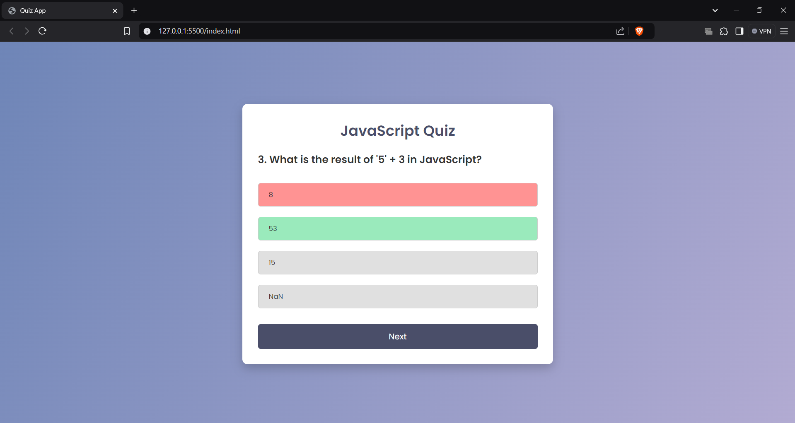

# Quiz App Project

Name: Anurag Ganesh Tiwari

Company: CODTECH IT SOLUTIONS PVT.LTD

ID: CT08DQL

Domain: Frontend Web Development

Duration: Dec 12th 2024 to Jan 12th 2025

Mentor: [Mentor Name]

## Overview of the Project

Project: Interactive JavaScript Quiz Application

## Objective

The objective of this project is to create an interactive quiz application using HTML, CSS, and JavaScript. The app presents users with multiple-choice questions about JavaScript programming, tracks their scores, and provides immediate feedback on their answers through a clean and intuitive user interface.

## Key Features

- Dynamic Question Loading: Questions are loaded dynamically from a predefined array of questions and answers
- Interactive UI: Clean and responsive user interface with hover effects and visual feedback
- Score Tracking: Keeps track of user's score throughout the quiz
- Answer Validation: Immediate feedback on correct and incorrect answers with visual indicators
- Progress Management: "Next" button appears only after answering current question
- Quiz Reset: Option to replay the quiz after completion
  

## Technologies Used

- HTML5: Structure and semantic markup
- CSS3: Styling and animations
  - Custom gradients and transitions
  - Responsive design principles
  - Google Fonts integration
- JavaScript: Core functionality
  - DOM manipulation
  - Event handling
  - State management
  - Array methods

## Implementation Details

1. Question Bank:
   - Structured array of question objects
   - Each question includes the question text and multiple answer options
   - Correct answer flagging system

2. UI Components:
   - Question display area
   - Answer buttons with hover effects
   - Next/Play Again button
   - Score display
   - Color-coded feedback system

3. Core Functions:
   - startQuiz(): Initializes the quiz
   - showQuestion(): Displays current question
   - selectAnswer(): Handles answer selection
   - handleNextButton(): Manages question progression
   - showScore(): Displays final results

## Future Enhancements

- Timer functionality for each question
- Different difficulty levels
- Category selection for questions
- Local storage for high scores
- More interactive animations
- Sound effects for feedback
